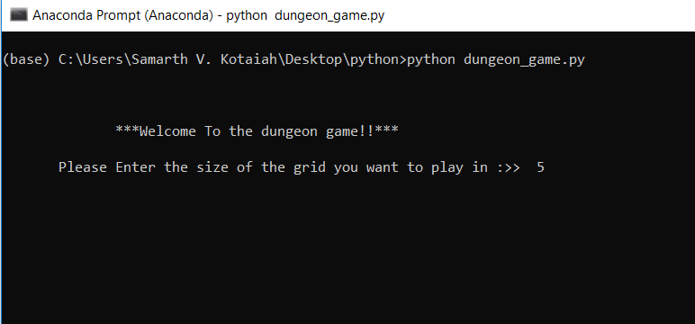
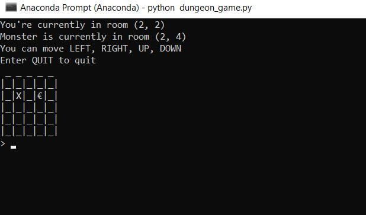
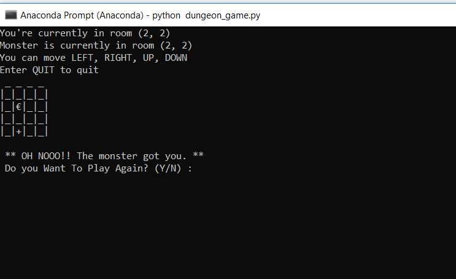
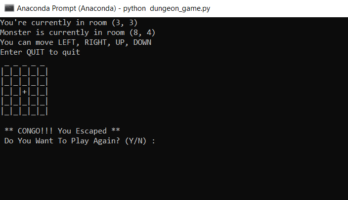

# The-Dungeon-Game
Interesting Dungeon Game written in Python

### Objective of the game
- The player is locked inside a dungeon, along with a monster roaming inside the dungeon.
- There is a door out of the dungeon, **but the door is hidden**.
- The player needs to escape the monster, and the dungeon by moving, and finding the hidden door. The door can be anywhere.
- The player wins if he lands on the door, and loses if he falls into the hands of the monster.

### Rules of the game
- X, €, + denote the player, monster, and door respectively.
- Player can move one step at a time, in Left, Right, Up, or Down directions
- The Monster also moves one step at a time, **but the monster can move diagonally, or hold its position also**.
- The dungeon boundaries act as walls. The player can not go through them.

#### Welcome to the Dungeon

#### The Gameplay

#### When the monster is hungry

#### The Taste of VICTORY

